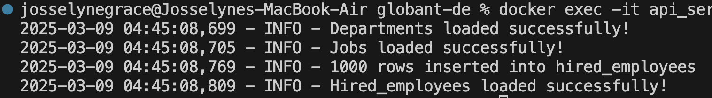
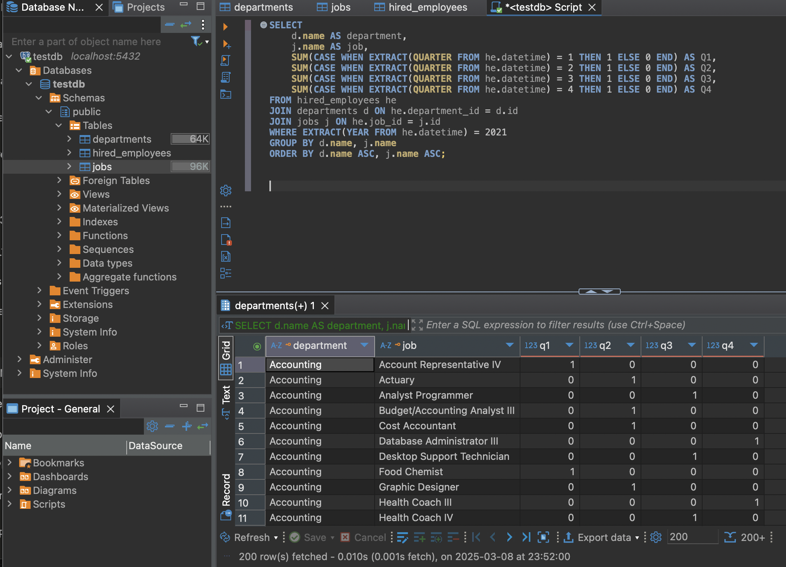
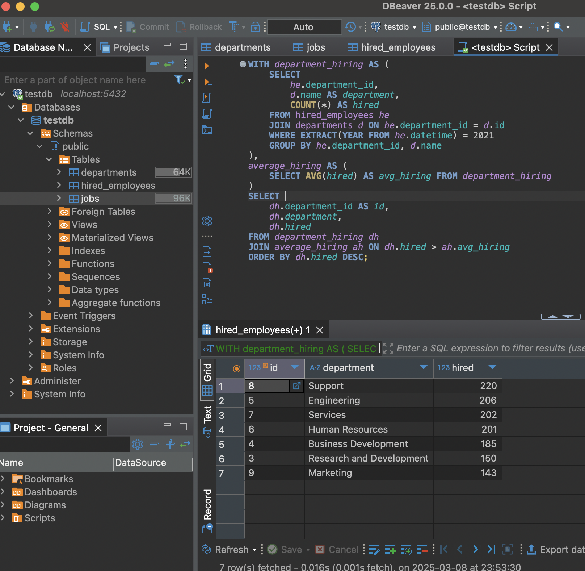

# FastAPI & PostgreSQL Data Loader

## Project Overview
This project provides a REST API built with FastAPI and PostgreSQL to handle CSV data ingestion. It includes:
- A structured database model (star schema).
- Batch data insertion (up to 1000 rows per request).
- API endpoints to upload CSV files.

## Prerequisites

### 1. Install Dependencies (MacOS)
1. **Install Docker** (Version `4.37` recommended to avoid malware warnings):
   ```bash
   brew install --cask docker
   ```
2. **Install Git**:
   ```bash
   brew install git
   ```
3. **Clone the repository**:
   ```bash
   git clone https://github.com/globant-de.git
   cd globant-de
   ```

## 2. Setting up the Environment

### - Pull and Run PostgreSQL
1. **Grant execution permissions to the entrypoint script (only needed once)**:
   ```bash
   chmod +x entrypoint.sh 
   ```
2. **Stop containers and remove previous volumes**:
   ```bash
   docker compose down -v 
   ```
3. **Pull PostgreSQL image (if not already installed)**:
   ```bash
   docker pull postgres:15
   ```
4. **Build and start containers**:
   ```bash
   docker-compose up --build
   ```

---

## **Question 1: Batch CSV Data Load (1000 rows per request)**

### Steps to Execute
1. Open another terminal and navigate to the project folder:
   ```bash
   cd api-rest
   ```
2. Validate that the database tables were created correctly:
   ```bash
   docker exec -it postgres_local psql -U admin -d testdb -c "\dt"
   ```
3. Load CSV Data:
   ```bash
   docker exec -it api_service python -m scripts.load_csv
   ```
4. **Support Image:**  
   

---

## **Question 2: SQL Queries for Data Analysis**

### **Employees Hired Per Quarter (2021)**
#### **SQL Query:**
```sql
SELECT 
    d.name AS department,
    j.name AS job,
    SUM(CASE WHEN EXTRACT(QUARTER FROM he.datetime) = 1 THEN 1 ELSE 0 END) AS Q1,
    SUM(CASE WHEN EXTRACT(QUARTER FROM he.datetime) = 2 THEN 1 ELSE 0 END) AS Q2,
    SUM(CASE WHEN EXTRACT(QUARTER FROM he.datetime) = 3 THEN 1 ELSE 0 END) AS Q3,
    SUM(CASE WHEN EXTRACT(QUARTER FROM he.datetime) = 4 THEN 1 ELSE 0 END) AS Q4
FROM hired_employees he
JOIN departments d ON he.department_id = d.id
JOIN jobs j ON he.job_id = j.id
WHERE EXTRACT(YEAR FROM he.datetime) = 2021
GROUP BY d.name, j.name
ORDER BY d.name ASC, j.name ASC;
```
#### **Support Image:**  
   

---

### **Departments Hiring Above Average (2021)**
#### **SQL Query:**
```sql
WITH department_hiring AS (
    SELECT 
        he.department_id, 
        d.name AS department,
        COUNT(*) AS hired
    FROM hired_employees he
    JOIN departments d ON he.department_id = d.id
    WHERE EXTRACT(YEAR FROM he.datetime) = 2021
    GROUP BY he.department_id, d.name
),
average_hiring AS (
    SELECT AVG(hired) AS avg_hiring FROM department_hiring
)
SELECT 
    dh.department_id AS id, 
    dh.department, 
    dh.hired
FROM department_hiring dh
JOIN average_hiring ah ON dh.hired > ah.avg_hiring
ORDER BY dh.hired DESC;
```
#### **Support Image:**  
   

---

## **Question 3: Docker & API Testing**

### **API Testing**
Once the API is running, test the connection:
```bash
curl http://localhost:8000/ping
```
#### Expected Response:
```json
{"message":"API is running!"}
```

#### **Support Image:**  
   

---

## **Debugging & Useful Commands**
- **Check running containers**:
  ```bash
  docker ps -a
  ```
- **Restart API container**:
  ```bash
  docker restart api_service
  ```
- **Check logs**:
  ```bash
  docker logs api_service --tail 50
  ```
- **Shut down everything**:
  ```bash
  docker compose down -v
  ```

---

## **Contribution**
1. Fork the repository.
2. Create a feature branch: `git checkout -b feature-branch`
3. Commit changes: `git commit -m "Description"`
4. Push changes: `git push origin feature-branch`
5. Submit a pull request.

---

💡 **Tip:** If you encounter issues, restart Docker and verify `.env` variables are correctly set!
